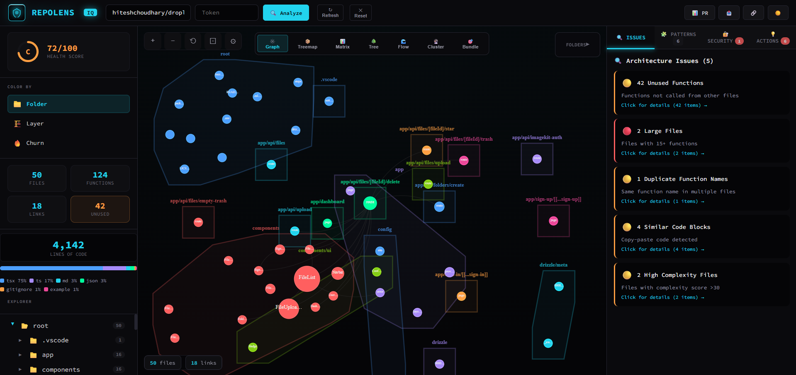

<div align="center">

# 🪬 RepoLens IQ 

### Instant Codebase Intelligence for GitHub

[](https://repo-lens-iq.vercel.app)

**RepoLens IQ** turns any GitHub repository into **instant, actionable insights**—right in your browser.

**No installation. No backend. No tracking.**

[](https://opensource.org/licenses/MIT)
[](http://makeapullrequest.com)
[](https://github.com/RishiBuilds/RepoLens-IQ)
[](https://github.com/RishiBuilds/RepoLens-IQ)

[Report a Bug](https://github.com/RishiBuilds/RepoLens-IQ/issues) • [Pull Requests Welcome](https://github.com/RishiBuilds/RepoLens-IQ/pulls)



</div>

---

## Why RepoLens IQ?

Opening a new codebase shouldn’t mean hours of guesswork, hidden dependencies, and unnecessary risk.
**RepoLens IQ** gives you **clear, visual, actionable insight** into how a repository is structured...and how **every change ripples through it**..so teams can **onboard faster, make safer changes, and move with confidence**.


**Perfect for:**
- 👥 **Developers** onboard faster and understand the codebase from day one
- 🔍 **Tech leads** review pull requests with real architectural context
- 🏗️ **Architects** plan refactors with visibility into dependencies and risk
- 🌟 **Open-source contributors** explore unfamiliar repositories with confidence

```
🪬 Paste a GitHub URL → Reveal the Architecture → Decide with Confidence
```

---

## Key Features

### 🗺️ Architecture Visualization
Visualize the entire repository as an interactive dependency graph.
- See how files and modules connect
- Zoom, pan, drag, and explore freely
- Instantly identify tightly coupled areas
  
### 💥 Blast Radius Analysis
Understand change impact before touching code.
- Select a file and see all affected dependencies
- Quickly assess risk for refactors or PRs
- Ideal for large or legacy codebases

### 👥 Code Ownership Insights
Know who owns what.
- Identify top contributors per file using Git history
- Useful for reviews, debugging, and collaboration

### 🔐 Security Scanner
Detect common security risks automatically:
- Hardcoded secrets and API keys
- Dangerous `eval()` usage
- SQL injection patterns
- Debug statements left in production

### 🧩 Pattern & Anti-Pattern Detection
Automatically identifies:
- Design patterns (Singleton, Factory, Observer)
- React custom hooks
- Anti-patterns such as god objects, high coupling, and circular dependencies

### 📊 Codebase Health Score
Get an instant A–F grade based on:
- Dependency structure
- Dead code indicators
- Security issues
- Coupling and complexity

### 🔥 Activity Heatmap
See which parts of the repository are most active.
- Files colored by commit frequency
- Quickly identify hot paths and unstable areas

### 📈 Pull Request Impact Analysis
Paste a PR URL to:
- See changed files
- Calculate blast radius
- Understand review risk at a glance

---

## Privacy-centric

RepoLens IQ is built with **strict privacy principles** from the ground up.

### What We Don't Do
- ❌ No backend servers
- ❌ No analytics or tracking
- ❌ No code storage or logging
- ❌ No data collection
- ❌ No third-party services

### What We Do
- ✅ Runs **100% in your browser**
- ✅ All processing happens locally
- ✅ Makes API calls directly from your browser to GitHub
- ✅ GitHub tokens (if used) stay only in browser memory
- ✅ Tokens are cleared when you close the tab
- ✅ Works with both public and private repositories

---

## How It Works

RepoLens IQ uses a simple, privacy-first architecture:

1. **Input:** You paste a GitHub repository URL (or `owner/repo` format)
2. **Fetch:** RepoLens IQ fetches repository metadata and file contents using GitHub's REST API
3. **Parse:** Files are analyzed locally in your browser using client-side parsers
4. **Visualize:** D3.js generates an interactive dependency graph in real time
5. **Analyze:** Security scans, pattern detection, and health scoring happen instantly


**Key Points:**
- ✅ All processing happens **locally in your browser**
- ✅ No data is sent to external servers
- ✅ GitHub tokens (if used) never leave your browser
- ✅ Works offline after initial repository fetch

**No build process. No dependencies. No npm install. It's just one HTML file.**

---

## Quick Start

### Option 1: Use Online (Recommended)
Open **[RepoLens IQ](https://repo-lens-iq.vercel.app)** in your browser and paste any GitHub repository URL to instantly explore its structure and insights.

→ No setup. No install. No sign-up.

---

### Option 2: Self-Host
Run RepoLens IQ locally in seconds.

1. **Clone the repository**
   ```bash
   git clone https://github.com/RishiBuilds/RepoLens-IQ.git

2. Open `index.html` in your browser

That's it! No build process, no npm install, no dependencies. **It's just one HTML file.**

---

## Usage

### Public Repositories
Simply paste the repository URL or owner/repo format:
```
RishiBuilds/RepoLens-IQ
```
or
```
https://github.com/RishiBuilds/RepoLens-IQ
```

### Private Repositories
1. Create a [GitHub Personal Access Token](https://github.com/settings/tokens) with `repo` scope
2. Paste it in the Token field (optional, but recommended for private repos)
3. Enter your repository URL and analyze

**Note:** Tokens are stored only in browser memory and cleared when you close the tab.

### Shareable Links
After analysis, click the 🔗 button to copy a shareable link. Anyone with the link can re-run the same analysis instantly.

### Pull Request Analysis
1. Analyze a repository first
2. Click the **📊 PR** button
3. Paste a PR URL (e.g., `https://github.com/owner/repo/pull/123`)
4. See changed files with blast radius impact analysis

---

## Supported Languages

RepoLens IQ extracts functions and analyzes dependencies for:

| Language | Extensions |
|----------|------------|
| JavaScript | `.js`, `.jsx` |
| TypeScript | `.ts`, `.tsx` |
| Python | `.py` |
| Java | `.java` |
| Go | `.go` |
| Ruby | `.rb` |
| PHP | `.php` |
| Vue | `.vue` |
| Svelte | `.svelte` |

---

## Visualization Modes

| Mode | Description |
|------|-------------|
| 📁 **Folder** | Color by directory structure |
| 🏗️ **Layer** | Color by architectural layer (UI, Services, Utils, etc.) |
| 🔥 **Churn** | Color by commit frequency (hot spots) |
| 💥 **Blast** | Color by impact when a file is selected |

---

## Keyboard Shortcuts

| Key | Action |
|-----|--------|
| `Enter` | Analyze repository |
| `+` / `-` | Zoom in/out |
| `Escape` | Close modal |

---

## API Limits

GitHub API has rate limits:
- **Without token:** 60 requests/hour
- **With token:** 5,000 requests/hour

For larger repositories, we recommend using a token.

---

## Architecture

```
┌─────────────────────────────────────────────────┐
│               RepoLens IQ: codeflow             │
├─────────────────────────────────────────────────┤
│  ┌──────────┐  ┌──────────┐  ┌──────────┐       │
│  │  Parser  │  │  GitHub  │  │    D3    │       │
│  │  Module  │  │   API    │  │  Graph   │       │
│  └──────────┘  └──────────┘  └──────────┘       │
│        │              │              │          │
│        └──────────────┼──────────────┘          │
│                       │                         │
│              ┌────────▼────────┐                │
│              │   React App     │                │
│              │  (Single File)  │                │
│              └─────────────────┘                │
└─────────────────────────────────────────────────┘
```

**Zero dependencies to install.** Everything runs from CDNs:
- React 18
- D3.js 7
- Babel (for JSX)

---

## Browser Compatibility

RepoLens IQ works in all modern browsers:
- ✅ Chrome/Edge (latest)
- ✅ Firefox (latest)
- ✅ Safari (latest)
- ✅ Opera (latest)

**Note:** Requires JavaScript enabled and modern ES6+ support.

---

## Limitations

- **File Limit:** Analyzes up to 100 files per repository for performance (larger repos will show a warning)
- **Language Support:** Currently supports 10 languages
- **GitHub API:** Subject to GitHub's rate limits (60 requests/hour without token, 5,000 with token)
- **Large Repositories:** Very large codebases may take longer to analyze
- **Private Repos:** Requires a GitHub Personal Access Token

---

## Examples

Try analyzing these repositories to see RepoLens IQ in action:

- **React:** `facebook/react`
- **Vue.js:** `vuejs/vue`
- **TypeScript:** `microsoft/TypeScript`
- **Node.js:** `nodejs/node`
- **Your own repo:** Just paste any GitHub URL!

---

## Contributing

Contributions are welcome! Here's how you can help:

1. **Report bugs:** Open an issue with clear steps to reproduce, expected behavior, and screenshots or logs if possible.
2. **Suggest features:** Share your ideas in the Issues or Discussions tab, explaining the problem and the value of your proposal.
3. **Submit PRs:** Fork the repository, create a feature branch, make your changes, and open a pull request with a concise description.
4. **Improve documentation:** Help refine the README, in-app copy, or code comments to make RepoLens IQ easier to understand.
5. **Share:** Star the repo and share it with other developers who might benefit from it.

### Guidelines

- Keep the single-file architecture (everything in `index.html`).
- Maintain zero dependencies (only use trusted CDNs when absolutely necessary).
- Follow the existing code style and patterns used in the project.
- Test in multiple browsers (Chrome, Firefox, Edge at minimum) before submitting.
- Keep pull requests focused and small, with clear commit messages.

By contributing, you agree that your contributions will be licensed under the same MIT License as this project.

---

## License

RepoLens IQ is released under the MIT License.  
You are free to use, modify, and distribute this software, provided that you include the original copyright and license notice in any copies or substantial portions of the software.  

See the [LICENSE](./LICENSE) file in this repository for the full text.

---

<div align="center">

**Crafted 🧩 by developers, for developers**

*See the system before you change it.*

[⭐ Star on GitHub](https://github.com/RishiBuilds/RepoLens-IQ) • [🐛 Report Issue](https://github.com/RishiBuilds/RepoLens-IQ/issues) • [💬 Join Discussions](https://github.com/RishiBuilds/RepoLens-IQ/discussions)

</div>

---

<div align="center">

© 2025 • MIT License

</div>


